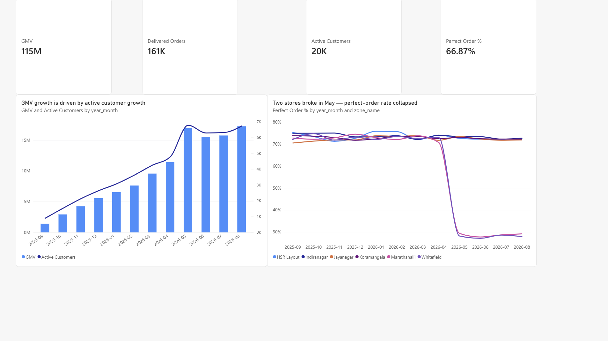

# QuickKart — Product Growth & Marketplace Health Analytics

**A Blinkit-style quick-commerce business, built and analyzed end to end.**
12 months · 23,670 customers · 161K delivered orders · ₹11.5 Cr GMV · 405K app sessions · 6 dark stores

`T-SQL (SQL Server)` · `Power BI (star schema + DAX)` · `Python (NumPy/pandas)`

> **Data disclaimer:** every row is simulated. "QuickKart" is a fictional
> platform; no real company's data is used or implied. The generator injects
> known, realistic business patterns (documented ground truth) — the analysis
> then has to *rediscover* them, which makes every insight verifiable.

---

## The one-paragraph pitch

Quick commerce wins by turning a 10-minute promise into a weekly habit. This
project measures that machine end to end — acquisition cost → activation →
funnel → retention → unit economics → store operations — in production-style
T-SQL on a proper star schema, and lands on six decision-ready insights with
an executive Power BI dashboard. Headline: **the first order decides
everything** — a late or incomplete first delivery cuts 28-day repeat from
72% to 44% and lifts long-run churn by 17 points.

## Key findings

| # | Finding | Evidence |
|---|---------|----------|
| 1 | Bad first orders are the #1 churn driver | repeat-28d 43.9% vs 72.5%; churn +16.5 pp (`sql/14`) |
| 2 | Two stores broke in May; demand noticed | on-time 73.7%→30.6%, zone churn +12.9 pp, cart→checkout −5.2 pp (`sql/17`, `12`) |
| 3 | The May promo bought volume, not customers | discount-led cohort M1 20.8% vs 54.6%; June gave back ₹14L (`sql/13`, `16`) |
| 4 | Channel budget misallocated at activated-CAC level | influencer ₹600/activated, payback month 4 vs referral ₹140, month 0 (`sql/10`) |
| 5 | Margin/order grows +48% with tenure — a pullable lever | ₹151 (M0) → ₹224 (M6+) via high-margin attach (`sql/16`) |
| 6 | Search is the under-used high-intent path | 56.6% vs 30.7% session conversion (`sql/12`) |

Full narrative with recommendations: **[docs/insights_report.md](docs/insights_report.md)**

## Architecture

```
python data/generate_data.py          seeded simulation, 6 injected scenarios
        │   7 CSVs (~2.4M rows)
        ▼
sql/00-02   database · star schema · BULK INSERT
sql/03      post-load indexes, FKs, 11-check data-quality audit
sql/04      base views (delivered orders / customer spine / order economics)
        ▼
sql/10-19   analysis modules
   10 acquisition & CAC payback      15 RFM segmentation
   11 activation & aha-moment        16 GMV decomposition & monetization
   12 funnel (event-log SQL)         17 marketplace / store ops health
   13 retention cohorts              18 HEART experience scorecard
   14 churn & lifecycle              19 customer & product health scores
        ▼
sql/20      Power BI feed views  ──►  powerbi/ (model, 25+ DAX measures,
                                      5-page dashboard build guide)
```

## Repo map

```
data/       generate_data.py (seeded generator; output/ is gitignored)
sql/        00-20: schema → load → quality → base views → 10 analysis modules → BI views
powerbi/    model_and_measures.md · build_guide.md
docs/       insights_report · metric_definitions · resume_bullets ·
            interview_qa (22 Q&A) · study_guide
scripts/    load_to_sqlserver.py (pyodbc alternative to BULK INSERT)
```

## Quickstart

```bash
# 1. generate the data (~1 min; deterministic, seed=42)
pip install -r requirements.txt
python data/generate_data.py

# 2. load into SQL Server (2019+; Developer/Express are free)
#    run sql/00 → 01, then 02 in SQLCMD mode with your path
#      :setvar DataPath "C:\...\blinkit-product-analytics\data\output"
#    (or: python scripts/load_to_sqlserver.py)

# 3. run sql/03 → 04, then any analysis module 10-19, then 20 for Power BI
```

First sanity check after loading: every row of the module-03 audit returns
**PASS**, and module 16's monthly KPIs should match the numbers quoted in
`docs/insights_report.md` exactly (the dataset is seeded).
**Full stage-by-stage checklist with exact expected outputs: [VERIFICATION.md](VERIFICATION.md).**

## Dashboard

5 pages: Executive Overview · Growth & Funnel · Retention Cohorts ·
Marketplace Health · Segments & Health Scores.
Build steps in [powerbi/build_guide.md](powerbi/build_guide.md).
<!-- After building: add screenshots


-->

## What this project demonstrates

- **SQL depth:** window functions (ROW_NUMBER, LAG, NTILE, running sums),
  conditional aggregation for funnels & cohort triangles, CROSS/OUTER APPLY,
  right-censoring, exact MoM driver decomposition — all on 2.4M rows.
- **Product-metrics fluency:** AARRR + HEART, activation windows, cohort
  retention, churn definitions, CAC vs activated-CAC vs payback, GMV vs net
  revenue vs contribution, RFM and composite health scores — each with a
  documented definition *and caveat* (`docs/metric_definitions.md`).
- **Analytical honesty:** simulated data declared up front, assumptions
  (₹30 last-mile cost) surfaced, attribution methods named, ground truth
  reproducible via a fixed seed.

## Related projects

- **Promotion Framing Optimization (A/B testing)** — experimentation design &
  statistics companion to this project (this repo deliberately leaves
  experimentation out of scope).

---
*Built as a portfolio project for Product/Data Analyst roles. Dataset:
simulated. Feedback welcome via issues.*
